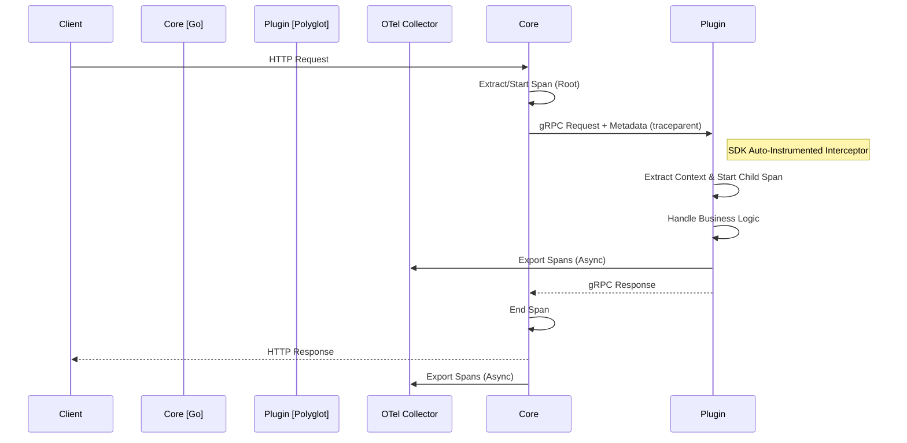

# 技术设计 (Design): 多语言 SDK 可观测性自动注入

## 1. 架构概览 (Architecture Overview)

本设计旨在通过 SDK 层面的自动注入 (Auto-Instrumentation)，实现 Polyshift 框架下跨语言调用的全链路追踪。

### 1.1 追踪上下文传播 (Trace Context Propagation)
Core 与 Plugin 之间通过 gRPC Metadata 传递 Trace Context，遵循 W3C Trace Context (`traceparent`) 标准。



## 2. 详细设计 (Detailed Design)

### 2.1 Python SDK 实现
*   **依赖库**:
    *   `opentelemetry-api`
    *   `opentelemetry-sdk`
    *   `opentelemetry-instrumentation-grpc`
    *   `opentelemetry-exporter-otlp`
*   **实现逻辑**:
    在 `sdk/python/polyshift/plugin/server.py` 中：
    1.  初始化 `TracerProvider`。
    2.  添加 `BatchSpanProcessor` 和 `OTLPSpanExporter` (或 `ConsoleSpanExporter`)。
    3.  使用 `GrpcInstrumentorServer` 自动包装 gRPC Server。

```python
# 伪代码示例
from opentelemetry import trace
from opentelemetry.sdk.trace import TracerProvider
from opentelemetry.instrumentation.grpc import GrpcInstrumentorServer

def instrument():
    trace.set_tracer_provider(TracerProvider())
    GrpcInstrumentorServer().instrument()
```

### 2.2 Java SDK 实现
*   **依赖库**:
    *   `io.opentelemetry:opentelemetry-api`
    *   `io.opentelemetry:opentelemetry-sdk`
    *   `io.opentelemetry.instrumentation:opentelemetry-grpc-1.6`
*   **实现逻辑**:
    在 `sdk/java/src/main/java/com/polyshift/plugin/PluginServer.java` 中：
    1.  在 `ServerBuilder` 中添加 `GrpcTelemetry.create(openTelemetry).newServerInterceptor()`。

```java
// 伪代码示例
ServerBuilder.forPort(port)
    .intercept(GrpcTelemetry.create(GlobalOpenTelemetry.get()).newServerInterceptor())
    .addService(new PluginServiceImpl())
    .build();
```

### 2.3 Node.js SDK 实现
*   **依赖库**:
    *   `@opentelemetry/api`
    *   `@opentelemetry/sdk-node`
    *   `@opentelemetry/instrumentation-grpc`
*   **实现逻辑**:
    在 `sdk/js/index.js` 中：
    1.  使用 `NodeSDK` 启动自动插桩，包含 `GrpcInstrumentation`。

```javascript
// 伪代码示例
const { NodeSDK } = require('@opentelemetry/sdk-node');
const { GrpcInstrumentation } = require('@opentelemetry/instrumentation-grpc');

const sdk = new NodeSDK({
  instrumentations: [new GrpcInstrumentation()],
});
sdk.start();
```

### 2.4 C++ SDK 实现
*   **依赖库**: `opentelemetry-cpp`
*   **实现逻辑**:
    在 `sdk/cpp/src/server.cc` 中：
    1.  使用 `opentelemetry::trace::Provider::GetTracerProvider()` 获取全局 Tracer。
    2.  在 `ServerBuilder` 中注册 Interceptor (需手动实现或使用 contrib 库)。
    *   *注*: C++ 生态中 gRPC Interceptor 支持相对较新，若官方库支持不足，可考虑手动在 `HandleRequest` 入口处提取 Metadata 并创建 Span。鉴于复杂度，**C++ 部分优先实现手动提取 Metadata**。

## 3. 配置管理 (Configuration)

SDK 将统一读取以下环境变量：

| 变量名 | 描述 | 默认值 |
| :--- | :--- | :--- |
| `OTEL_TRACES_EXPORTER` | 导出器类型 | `stdout` (开发), `otlp` (生产) |
| `OTEL_EXPORTER_OTLP_ENDPOINT` | OTLP 收集器地址 | `http://localhost:4317` |
| `OTEL_SERVICE_NAME` | 服务名称 | 插件名称 (从 `plugin.yaml` 读取) |
| `OTEL_TRACES_SAMPLER` | 采样策略 | `parentbased_always_on` |

## 4. 接口变更 (API Changes)
无公开 API 变更。所有变更均在 SDK 内部实现，对插件开发者透明。
唯一例外是构建配置 (如 `pom.xml`, `package.json`, `requirements.txt`) 的依赖项增加。
