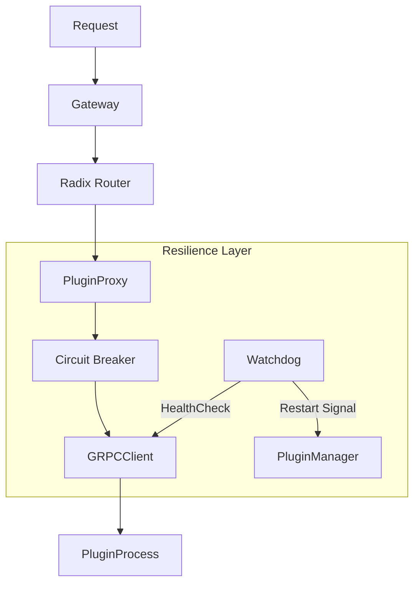

# 技术设计 (Design): 弹性与高可用性增强

## 1. 架构调整 (Architecture Changes)

### 1.1 模块概览
新增 `resilience` 包，包含 `Watchdog` 和 `Breaker` 组件。重构 `gateway` 的路由模块。



### 1.2 Watchdog 设计
*   **组件**: `HealthMonitor`
*   **职责**: 维护所有插件的健康状态和重启策略。
*   **实现**:
    *   使用 `time.Ticker` 进行全局轮询，而不是每个插件一个 Ticker，减少资源消耗。
    *   维护 `map[string]*BackoffStrategy` 记录每个插件的退避状态。
    *   当检测到故障时，调用 `PluginManager.ReloadPlugin` (需修改以支持带延迟的启动)。

### 1.3 熔断器设计
*   **选型**: 使用 `sony/gobreaker` 库（成熟、轻量）。
*   **集成**:
    *   在 `PluginInstance` 中嵌入 `*gobreaker.CircuitBreaker`。
    *   在 `Client.HandleRequest` 前调用 `cb.Execute(...)`。
    *   **错误定义**: gRPC 返回的 `Unavailable`, `DeadlineExceeded`, `Unknown` 计为失败；`NotFound`, `InvalidArgument` 等业务错误不计入熔断。

### 1.4 Radix Router 设计
*   **数据结构**:
    ```go
    type node struct {
        path      string
        indices   string
        children  []*node
        handler   HandlerFunc
        wildChild bool
        nType     nodeType // static, param, catchAll
        priority  uint32
    }
    ```
*   **并发控制**:
    *   `Router` 结构体持有一个 `atomic.Value`，存储当前的 `*node` (Root)。
    *   **写操作**: 构建全新的 Tree -> `atomic.Store` 替换 Root。
    *   **读操作**: `atomic.Load` 获取 Root -> 遍历查找。
    *   这种方式实现了无锁读取，非常适合读多写少的路由场景。

## 2. 接口定义 (Interface Definitions)

### 2.1 路由接口
```go
type Router interface {
    Handle(method, path string, handler HandlerFunc)
    Lookup(method, path string) (HandlerFunc, Params, bool)
}
```

### 2.2 插件配置扩展
```go
type ResilienceConfig struct {
    HealthCheckInterval time.Duration `yaml:"health_check_interval"`
    CircuitBreaker      CBConfig      `yaml:"circuit_breaker"`
}

type CBConfig struct {
    Enabled        bool    `yaml:"enabled"`
    Timeout        time.Duration `yaml:"timeout"`
    MaxRequests    uint32  `yaml:"max_requests"`
    Interval       time.Duration `yaml:"interval"`
    ReadyToTrip    func(counts Counts) bool `yaml:"-"` // 逻辑实现
}
```

## 3. 实现步骤 (Implementation Steps)
1.  **Refactor Router**: 将 Gin 的路由替换为自定义的 Radix Router 实现（或基于 `httprouter` 修改）。
2.  **Implement Watchdog**: 在 `PluginManager` 中添加监控循环。
3.  **Add Circuit Breaker**: 引入 `gobreaker` 并封装到 `PluginInstance`。
4.  **Config Update**: 更新配置加载逻辑。
